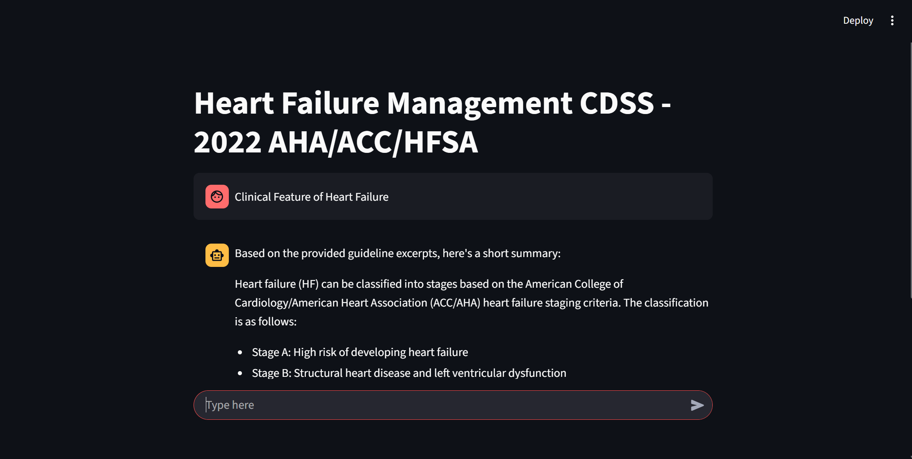
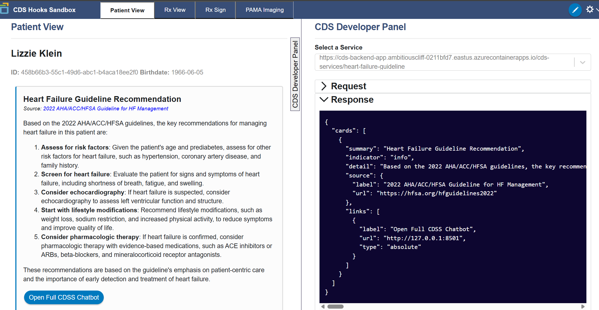
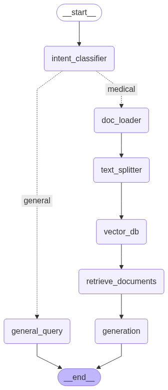

# Enterprise-Ready Clinical Decision Support System (CDSS) for Heart Failure

This project demonstrates a production-ready, AI-powered Clinical Decision Support System designed to bridge the gap between complex medical guidelines and point-of-care decision-making.  
By leveraging a **Retrieval-Augmented Generation (RAG)** pipeline, the system provides clinicians with instant, evidence-based answers from the **2022 AHA/ACC/HFSA Guideline for the Management of Heart Failure**.

The architecture is designed for **enterprise use**, featuring a decoupled frontend and backend, containerized for portability, and deployed on a scalable cloud platform (**Microsoft Azure**).

---

## 🚀 Live Cloud Deployment

The full application is deployed on **Microsoft Azure Container Apps**.

- **Live Chatbot Frontend**: https://cds-frontend-app.ambitiouscliff-0211bfd7.eastus.azurecontainerapps.io  
- **Live Backend API Docs**: https://cds-backend-app.ambitiouscliff-0211bfd7.eastus.azurecontainerapps.io/docs  

---

## ✨ Application in Action: Screenshots & Diagrams

This section provides a visual overview of the system's key components, from the user-facing interfaces to the backend architecture.

### 1. Interactive Chatbot (Frontend)
A **Streamlit** app for deep-dive Q&A.  


---

### 2. EHR Integration (CDS Hooks)
A CDS recommendation card pushed into a simulated **EHR**, following **CDS Hooks** standards.  


---

### 3. System Architecture (LangGraph)
The **state machine graph** that orchestrates the RAG pipeline.  


---

## 🎯 Core Features & Business Value

This system is more than a technical demo; it's a **blueprint for a real-world clinical tool**.

- **Reduces Clinical Workload**: Automates the time-consuming process of searching through dense medical documents, allowing physicians to get answers in seconds.  
- **Improves Quality of Care**: Promotes adherence to the latest evidence-based guidelines, ensuring consistent and high-quality patient care.  
- **Seamless EHR Integration**: Utilizes the CDS Hooks industry standard to push context-aware recommendations directly into the physician's workflow, requiring no extra clicks or context switching.  
- **Understands Patient Context**: Consumes and processes patient data in the **FHIR** format to provide relevant, patient-specific guidance.  

---

## 🏗️ Enterprise Architecture & Deployment

The system is built using a **modern, scalable, multi-service architecture**.

- **Containerization**: Both the **FastAPI backend** and **Streamlit frontend** are containerized with Docker, ensuring consistency across development and production environments.  
- **Cloud Deployment**: The application is deployed on **Microsoft Azure Container Apps**, a serverless platform that provides automatic scaling, HTTPS, and managed infrastructure.  
- **CI/CD Ready**: Images are versioned and stored on Docker Hub, enabling automated build and deployment pipelines.  

---

## 🛠️ Technology Stack

- **Backend**: Python, FastAPI, Uvicorn  
- **AI Engine**: LangChain, LangGraph, Retrieval-Augmented Generation (RAG)  
- **LLM Provider**: Groq (for Llama 3.1)  
- **Data & Storage**: ChromaDB (Vector Store), PyMuPDF  
- **Frontend**: Streamlit  
- **Health IT Standards**: CDS Hooks, FHIR  
- **Deployment**: Docker, Docker Compose, Microsoft Azure (Container Apps, CLI), Docker Hub  

---

## 🐳 Docker Hub Repositories

The container images for this project are publicly available on Docker Hub:

- **Backend Image**: [https://hub.docker.com/r/uddinazam9/cds-backend](https://hub.docker.com/r/uddinazam9/cds-backend)  
- **Frontend Image**: [https://hub.docker.com/r/uddinazam9/cds-frontend](https://hub.docker.com/r/uddinazam9/cds-frontend)  


---

## ⚙️ Running Locally with Docker Compose

To run the entire multi-container application on your local machine:

### Prerequisites
- **Docker** & **Docker Compose** installed  
- A `.env` file in the root directory with your `GROQ_API_KEY`

---

### 1. Run the Application
```bash
docker-compose up --build
